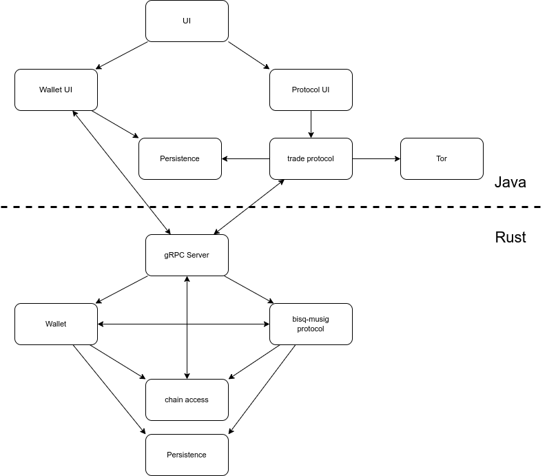

# Bisq MuSig2 Protocol

This is a module of Bisq2. It implements a new multisig trade protocol for Bisq2, similar to the protocol used in
Bisq1. It lets you buy/sell bitcoin from other peers without needing any trust in the other peer, a coordinator or
any other third party. Since there is no intermediary to conduct the exchange, this is as close as it gets to the
original bitcoin idea of conducting transactions p2p, secured just by cryptography.
Main changes compared to the Bisq1 protocol are:

- more private: the trade looks like a normal transaction without scripts
- lower fees: the happy path uses only one transaction
- uses Taproot
- instead of scripts it uses advanced cryptographic schemes like MuSig2 and adaptor signatures
- the protocol is designed to handle unresponsive traders automatically

## overview

This project handles the cryptographic part of the overall protocol. Even though it is the centerpiece,
more pieces are necessary to pull this off.
Here is an overview drawing:



The code is organised as a Cargo workspace:

| Crate                           | Purpose                                                                                                                   |
|---------------------------------|---------------------------------------------------------------------------------------------------------------------------|
| `protocol`                      | Cryptographic core: trade transaction builders (deposit, warning, redirect, claim, swap, custom payout), MuSig2 + adaptor signing, Taproot script paths |
| [`wallet`](wallet/README.md)    | BDK-based wallets (`BMPWallet`, `MemWallet`) and the `ProtocolWalletApi` trait consumed by `protocol`                     |
| `chain`                         | Small traits (`ChainApi`, `ChainScanner`) that decouple the wallets from a specific chain backend                         |
| [`rpc`](rpc/README.md)          | gRPC server (`musigd`), wallet test CLI (`musig-cli`) and a Java test client                                              |
| [`testenv`](testenv/README.md)  | Spins up `bitcoind` + `electrs` on regtest for the integration tests                                                      |
| `mem`                           | ZMQ helper for streaming unconfirmed transactions                                                                         |
| `bmp_tracing`                   | Shared tracing/logging initialisation                                                                                     |

## docs

Detailed docs are in the [Concepts](concept/README.md) section.
To get a more in-depth understanding of what this module is doing, please read [SingleTxOverview](./concept/SingleTxOverview.md).
This module's programming language is Rust.
Technologies include:

- bitcoin taproot transactions
- scriptless scripts (MuSig2, adaptor signatures)
- Rust
- gRPC
- Compact Block Filters (CBF)
- Bitcoin Development Kit (BDK), especially bdk-wallet
- crate tokio

If you have any knowledge in one of these areas, please consider contributing to this project.

## contribution

You can contact us at [matrix](https://matrix.to/#/#bisq-muSig-dev:matrix.org).
If you want to get a feeling for this project, check it out and run the tests:

```bash
cargo test
```

Building the `rpc` crate requires the protobuf compiler `protoc` on your `PATH` (or the `PROTOC` environment variable
pointing at it), e.g. `apt-get install -y protobuf-compiler` on Debian/Ubuntu.

See the [rpc/README.md](rpc/README.md) for details on running the Java integration tests.

Accepted contributions are eligible for compensation, so you could earn money for your work.

## Setting up precommit hooks (Optional)

The project comes bundled with a git pre-commit hook script that lints and formats the code before each commit.
To set it up, run:

`bash install-hooks.sh`

**NOTE**: Make sure you have `jq` and a nightly `rustfmt` installed
(`rustup toolchain install nightly --profile minimal --component rustfmt`). `rustfmt.toml` uses nightly-only options,
so format with `cargo +nightly fmt` rather than stable `cargo fmt`.

The command will copy the pre-commit script to your local `.git/hooks/pre-commit` file.
The hook runs `cargo clippy --all-targets` and only blocks on warnings in the files you are committing, then formats
just the lines you changed.
This helps us keep a clean build and focus on the essential parts when reviewing pull requests.

## logging / tracing

A small helper crate called `bmp_tracing` lives in the workspace.  It
exposes a single initialization function that all binaries and test
environments should call once at startup.  The API is intentionally
minimal:

```
bmp_tracing::init("info");
```

The function reads the standard `RUST_LOG` environment variable and falls
back to the supplied default level.  You can disable logging completely by
setting `RUST_LOG=off`.

## running the tests

The Rust tests automatically spin up a TestEnv with bitcoind and electrs as needed, so you may need some RAM and patience.

```bash
cargo test
```

Tests are run single-threaded by default for stability. To run them in parallel (faster but may be flaky):

```bash
TEST_MULTITHREADED=true cargo test
```

`./test-runner.sh` reruns the whole suite in parallel with 32 down to 1 test threads, for stress testing.

The Java integration tests are orchestrated via Maven and need some servers running first, see
[rpc/README.md](rpc/README.md#integration-tests-using-testenv-crate).

## reading the Markdown files

Some of the markdown files have LaTeX included, you can best view them using RustRover.
GitHub is bad at displaying LaTeX. There is also an html export on the github pages of the project
at [github pages](https://bisq-network.github.io/bisq-musig/)
