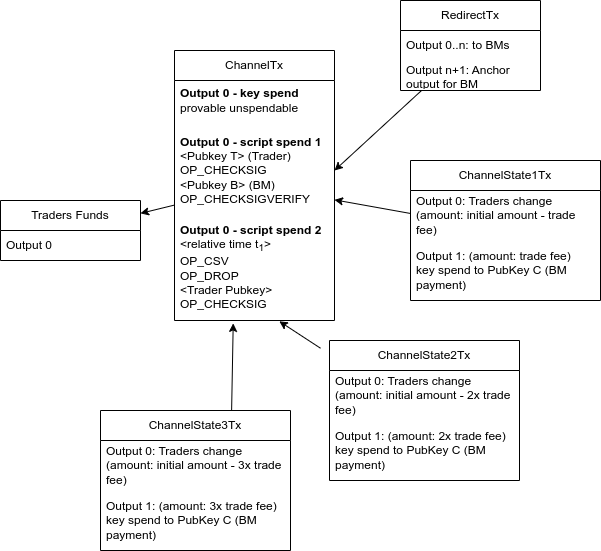

# trade fee payment on chain

This outlines a concept for trade fee payment using on-chain techniques.
The Solution presented includes 'unidirectional payment channels' as described in
the book 'Mastering Bitcoin' and silent payments (BIP-352).
To understand this article, you probably need an understanding of these two
technologies.

## terms

BM -- Burning master is a contributor which collects compensations through this mechanism.
Alice -- the trader which wants to pay fees through a Payment channel
Bob -- the peer trader, which does a trade with Alice.

## requirements

- one channel per user
- channel directly to BM (otherwise too many on-chain fees)
- creating a channel is no requirement.
- channel capacity is limited.
- one channel with one BM
- BM must not be online when creating the channel
- BM must not be online when a channel is used.
- Alice should be able to close the channel (even if BM is unresponsive).
- no address reuse on the trader or contributor side.

## unidrectional channels

### opening

Alice broadcasts a transaction to a multisig, between Alice and a BM (ChannelTx).
If the Alice shall be
able to initiate the channel without communicating with the BM, Alice will not be able to
do the multisig using MuSig2. Instead, she will need to use a script. For the script she
needs to have a public key of the BM. This could be provided using a silent payment, see [BIP-352](https://github.com/bitcoin/bips/blob/master/bip-0352.mediawiki).
When opening the channel, Alice has to decide which capacity the channel gets. The channel size
has a limit.
For max privacy we use the segwit v0 multisig script as this is mostly used.

### usage

For each trade Alice makes, she uses the trade channel to pay the trade fees. To do so,
she will create a transaction from the channel multisig to an address of the BM (getting address
using silent payment). Then she presigns the transaction with his key. Since it's a multisig, his
key is not enough, but the BM can complete it at any time. For each trade fee Alice signs
another transaction, the amount must be the amount of the last transaction plus the fee.

### verification of the channel from Bob

Alice will send Bob the following message:

1. channel opening TxId.
2. channel update transaction (this is the payment of the fees)
3. channel RedirectTx (see below)
4. nonce value generated from tradeID, profileIDs of both traders and take offer date.
5. Signature of 1,2 and 3 to be verified with the pubkey key used in 1. (Schnorr Signature)

Bob verifies the message by:

1. channel opening transaction exists on blockchain, and the second party in the channel is the
   BM (see below the proof of payment)
2. verify channel update transaction
    1. is signed correctly by Alice
    2. the amount is correct
3. channel opening transaction capacity isn't exceeded
4. channel RedirectTx is partially signed by Alice and sends funds to all BMs
5. the nonce value is correct.
6. Signature verification

He does not verify the rest, especially not against previous transaction and double spend.
Although it's unnecessary that Bob verifies the channel update transaction's beneficiary is the
intended BM, because that can be made later on by the BM itself. A

After verification, Bob will will resend the message as a bisq mailbox message to the BM.
The BM does not need to be online
and can verify his part at any later point in time.

### verification from BM

Whenever the BM comes online, he will collect all messages and tries to decrypt them. He can
decrypt all messages to him. From those messages he learns which channel-opening Txids are for
him. He verifies all messages with the same Txid and checks if the channel update transactions are
correct and the amounts add up properly. If not, he signs and broadcasts the RedirectTx, which
will send all funds to the DAO for arbitration. Bob has posted the channel update
transactions which he validated. So if they don't add up, or there are too many transactions, the
arbitrator can decide if there was a fraud going on.

### close of the channel by BM

In the happy path the BM will close the channel when the channel is used up
or the BM is asked to close the channel by Alice.
After verification, he will issue the latest channel state transaction and that ends this protocol.

### close of the channel by Alice

Alice cannot close the channel without the BM. Once a BM gets to know a new channel
has opened, the BM sends a signature for the `RedirectTx` to Alice.
With it Alice can send the funds at any time to the DAO, which will need
to resolve the fund with the BM.
However, if the BM is not responsive, Alice can only use up the channel
capacity for further trade fees. Alice may complain to the DAO and such a complaint
would have consequences for the BM.

### double spend

Since Bob does not have the historical data of the ChannelStateTxs
he has no way to see if Alice does a double spend or not.
Only the BM can check the correctness of the ChannelStateTxs and therefore make sure
Alice is not double spending. If the BM is not online, this can lead
to double spends not detected immediately. They will be detected later on when the
BM comes online, at which point the BM can send the funds to the DAO using the `RedirectTx`.
The potential gain for someone to do this is low, as he gets only access to the fees and
the risk of being penalized is not calculatable. (Unless for some reason he knows that the
BM will not come online anymore.)

### proof of silent payment

Bob needs to make sure that the channel-opening transaction is correct
and is actually on the chain. He verifies:

- transaction is confirmed on the blockchain
- the amount is high enough for at least the current payment
- transaction beneficiary is multisig with the BM with silent payment address Pubkey $S$.
  He does not get the address $S$ from the other trader, instead that payment address must
  come from the DAO.

Alice needs to prove to Bob that the used Public key $B$ is
actually a silent payment address of the BM (derived from $S$). The BM needs to publish his silent payment address $S$
to the public.
According to [BIP-352](https://github.com/bitcoin/bips/blob/master/bip-0352.mediawiki), see
also [this explainer](../silentpayment/SilentPayment.md), the address
for a silent payment is calculated via:
$$(1)\hspace{5pt} B = S + hash(a \cdot S) \cdot G$$
where

- $S$ is the pubkey of the silent payment address
- $a$ is a secret of the first trader
- $B$ is the pubkey of the receiver address

[BIP-374](https://github.com/bitcoin/bips/blob/master/bip-0374.mediawiki) defines
a DLEQ (zero-knowledge discrete logarithm equality proof) to prove that the calculated address
$B$ is actually the correct address derived from silent payment $S$.
[BIP-375](https://github.com/bitcoin/bips/blob/master/bip-0375.mediawiki) describes how to
send a silent payment with PSBTs.

However, since I could not find rust implementations
of these BIPs, I propose to use a short-cut.
Looking at the equation given in (1), Alice sends $a\cdot S$ to Bob.
Sending $a\cdot S$ does not compromise any knowledge about $a$. Bob
then can calculate $B$ using the formula (1) and uses that as the payment address
in the transaction.

This calculation of $B$ by using $a \cdot S$ from Alice does not guarantee that the
result is actually a silent payment address of the BM. However, Alice cannot know the
secret key of $$S + hash(a \cdot S) \cdot G$$ no matter which value for $a \cdot S$ he will send to
the second trader. So worst-case Alice can trick Bob into an address which
is not spendable by anyone. In any case, Alice will not have any benefit.

